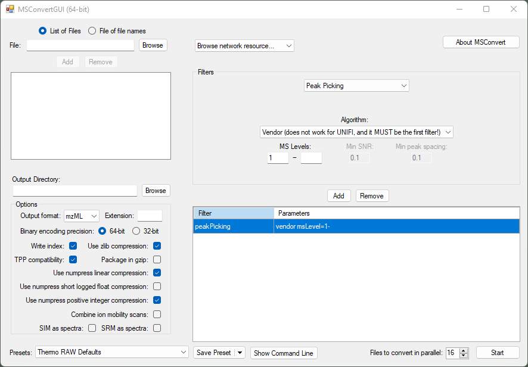

# Data conversion

Vendor specific format such as Bruker .d and Thermo Scientific .raw sometimes are not supported in the open 
source software. Therefore, we need to convert raw data to open formats such as .mzML for further processing.

## MSConvert (ProteoWizard)

MSConvert supports the conversion of AB SCIEX, Agilent, Bruker, Shimadzu, Thermo Scientific,
and Waters raw data. More information about the formats can be found in the 
[ProteoWizard Documentation for Users](https://proteowizard.sourceforge.io/doc_users.html).
Furthermore, profile data can be centroided to reduce the file size and memory consumption,
which can be important when processing larger datasets.

Recommended conversion settings for high-resolution MS data to mzML: 
* Use **64 bit** for _m/z_ to retain accuracy.
* **Compression is optional** but reduces the size significantly without much information loss - this might be instrument dependent though.
* The **peak picking** filter needs to be the first in the list - otherwise MSConvert might default to another algorithm than the selected vendor-specific one. 
* **Threshold peak filter** can be used to reduce some noise

