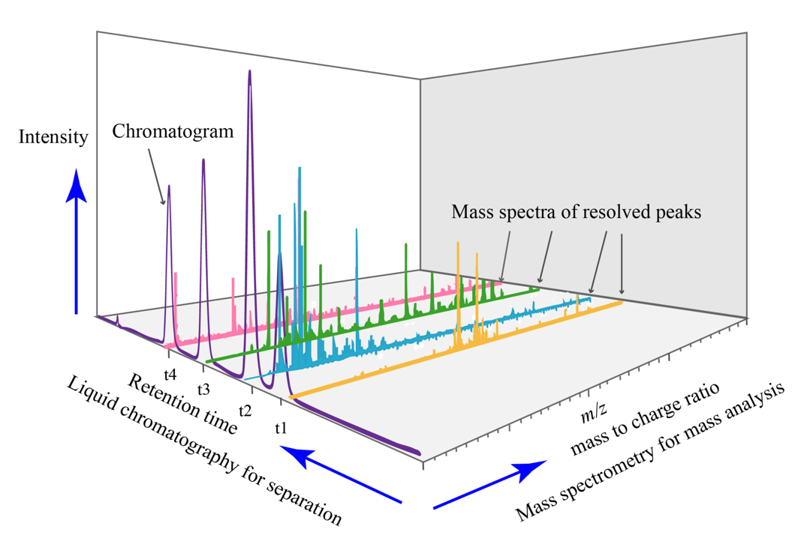
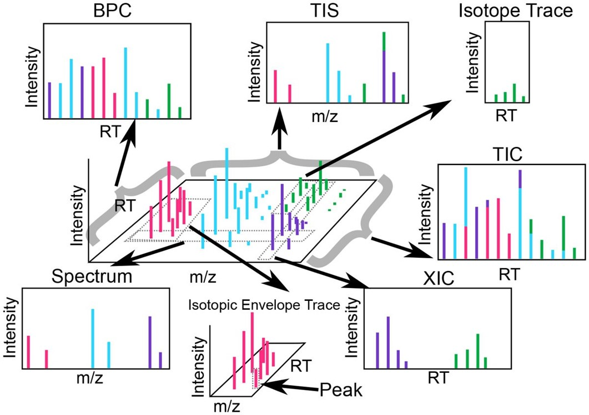
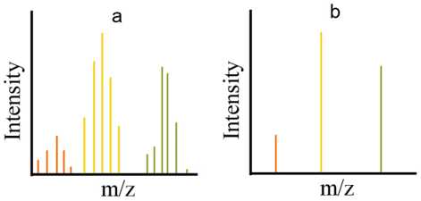

# LC-MS data structure

LC-MS data have a three-dimensional structure consisting of mass-to-charge ratio (m/z), retention time (RT), and intensity (abundance). The bascic data structure is illustrated below:

The abundances of the ions are plotted as a total ion chromatogram (TIC). This plot displays the peak intensities of the analyte ions versus their RT. Further, each point in the chromatogram is associated with a mass spectrum. The mass spectrum depicts the ion abundances versus the measured m/z values. 

## Nomenclature

- **Total ion chromatogram (TIC)**: The sum of all signals across all m/z.
- **Base peak chromatogram (BPC)**: The set containing the most intense signal for each RT across all m/z.
- **Spectrum**: A spectrum contains all points with a single RT value. 
- **Total ion spectrum (TIS)**: The sum of signals across all spectra. 
- **Extracted ion chromatogram (XIC)**: A slice of data containing a contiguous m/z range extending across all RT. 
- **Isotope trace**: The signal produced by a single ion of a single analyte (i.e., a peptide or a lipid) at a particular charge state.
- **Isotopic envelope trace**: The group of isotopic traces produced by a single analyte at a particular charge state. 

## MS data form
LC-MS data can be stored in two different forms: profile and centroid. 

- **Profile (a)**: the raw data detected by a mass spectrometer consists of distributed signal across m/z values at each point where an ion is detected.
- **Centroid (b)**: the raw data has been reduced to data points that represent the local maxima in a single spectrum, a distribution of data over an m/z range for a given RT.

## Ion mobility
Ion mobility spectrometry (IMS) adds an additional dimension to the LC-MS data structure by separating ions based on their size, shape, and charge. This results in a four-dimensional data structure consisting of m/z, RT, intensity, and drift time (DT). Ion mobility derives an additional separation of ions, providing enhanced resolution and identification capabilities. The ion mobility depends on the instrument type and can be represented in different ways, such as drift time (DT), inverse reduced mobility (1/K0), or collisional cross-section (CCS). CCS is an intrinsic property of the ion, reflecting its size and shape, and is independent of the instrument used for measurement. 

