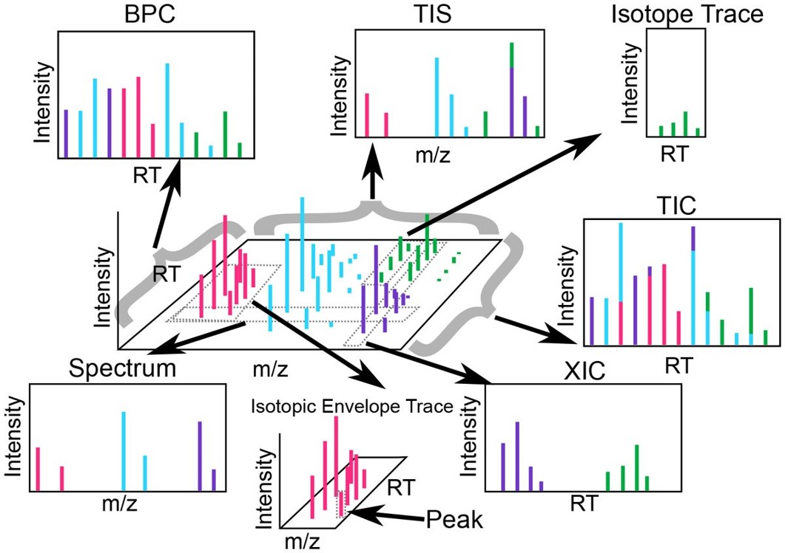
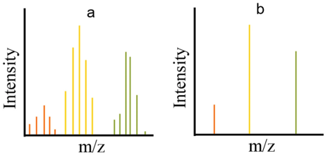

# LC–MS data structure

LC–MS(/MS) raw data can be viewed as a **time-ordered series of mass spectra** acquired over a chromatographic separation. Each spectrum contains signal intensities measured across **mass-to-charge ratio (m/z)** at a specific **retention time (RT)**. Together, the raw data form a three-dimensional data space:

- **m/z**
- **RT**
- **Intensity** (abundance)

A common visualization is the **total ion chromatogram (TIC)**, which summarizes each spectrum into a single intensity value and plots it versus RT. At any RT point in the TIC, the corresponding **mass spectrum** can be inspected to see how signal is distributed across m/z.

---

## Nomenclature

- **Chromatogram**: Intensity vs **RT** (constructed by summarizing or selecting m/z signals across spectra).
- **Spectrum**: Intensity vs **m/z** for a single acquisition time point (a “scan”) at a specific RT.

- **Total ion chromatogram (TIC)**: For each RT, the **sum of intensities across all m/z** in the spectrum (optionally within an m/z range).
- **Base peak chromatogram (BPC)**: For each RT, the **maximum intensity** observed in the spectrum (the base peak), plotted vs RT.

- **Total ion spectrum (TIS)**: The **sum (or average)** of intensities across spectra over an RT range, yielding a single spectrum summarizing that region.
- **Extracted ion chromatogram (XIC)**: Intensity vs RT for a **selected m/z window** (e.g., a narrow range around an expected m/z). XICs are used to inspect candidate compounds/features and assess peak shape and RT.

- **Isotope trace**: The chromatographic trace for one isotopologue (e.g., M, M+1) of a compound/feature within a defined m/z tolerance.
- **Isotopic envelope**: The set of isotope traces (M, M+1, M+2, …) associated with the same compound/feature (and charge state, if applicable).

---

## MS levels (MS1 vs MS2)

Depending on the acquisition method, files may contain:

- **MS1 spectra**: survey scans used for feature detection and quantification (typical for untargeted workflows).
- **MS2 (MS/MS) spectra**: fragmentation spectra used primarily for **annotation/identification** (library matching, structural inference).

---

## Data representation: profile vs centroid

LC–MS data are commonly stored in two forms: **profile** and **centroid**.

- **Profile data**: the instrument-reported signal over m/z, represented as a dense series of points.  
    - Pros: most information-rich; preserves peak shape.  
    - Cons: larger files; heavier computation.

- **Centroid data**: a reduced representation where each peak is summarized by (m/z, intensity) at local maxima (centroided peaks).  
    - Pros: smaller files; faster processing.  
    - Cons: centroiding choices can affect low-intensity signals and peak representation.

Practical implication: whether to work with profile or centroid depends on the instrument, conversion settings, and downstream software. If you centroid during conversion, document the method (e.g., vendor peak picking) and keep vendor raw files archived.

---

## Ion mobility (optional 4th dimension)

Ion mobility spectrometry (IMS) adds an additional separation based on ion size/shape/charge, creating a four-dimensional structure:

- **m/z**
- **RT**
- **Ion mobility**
- **Intensity**

Ion mobility may be reported as:

- **Drift time (DT)**: instrument-specific time coordinate
- **Inverse reduced mobility (1/K0)**: mobility metric that is more comparable across settings
- **Collision cross section (CCS)**: a physicochemical property related to ion shape/size; often used for identification support

IMS can improve separation of isomers and reduce spectral complexity, but it also increases data volume and may require IMS-aware processing tools.