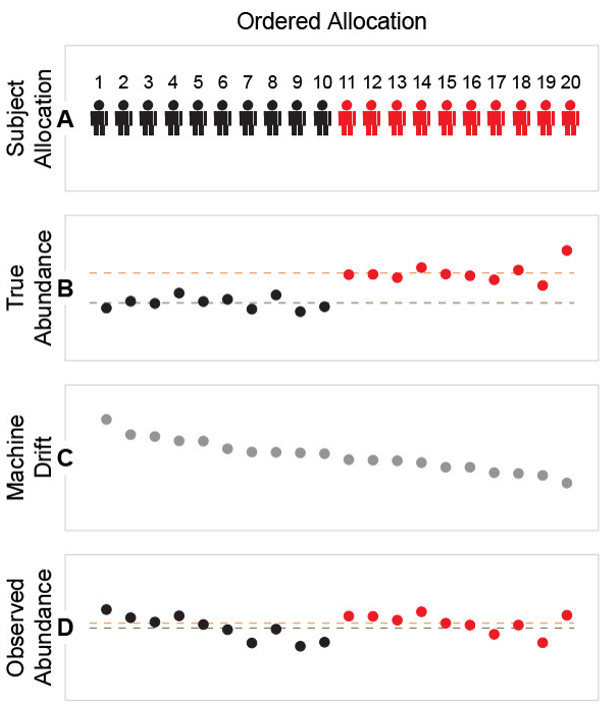
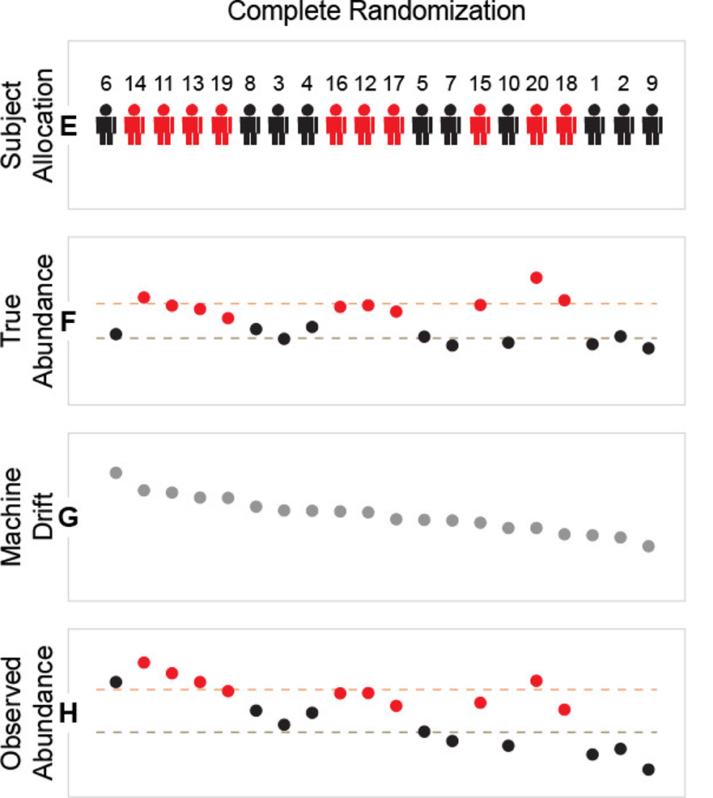
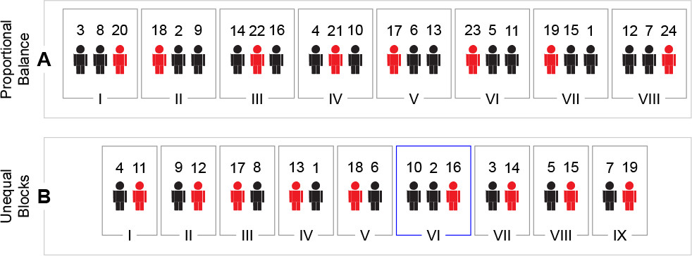
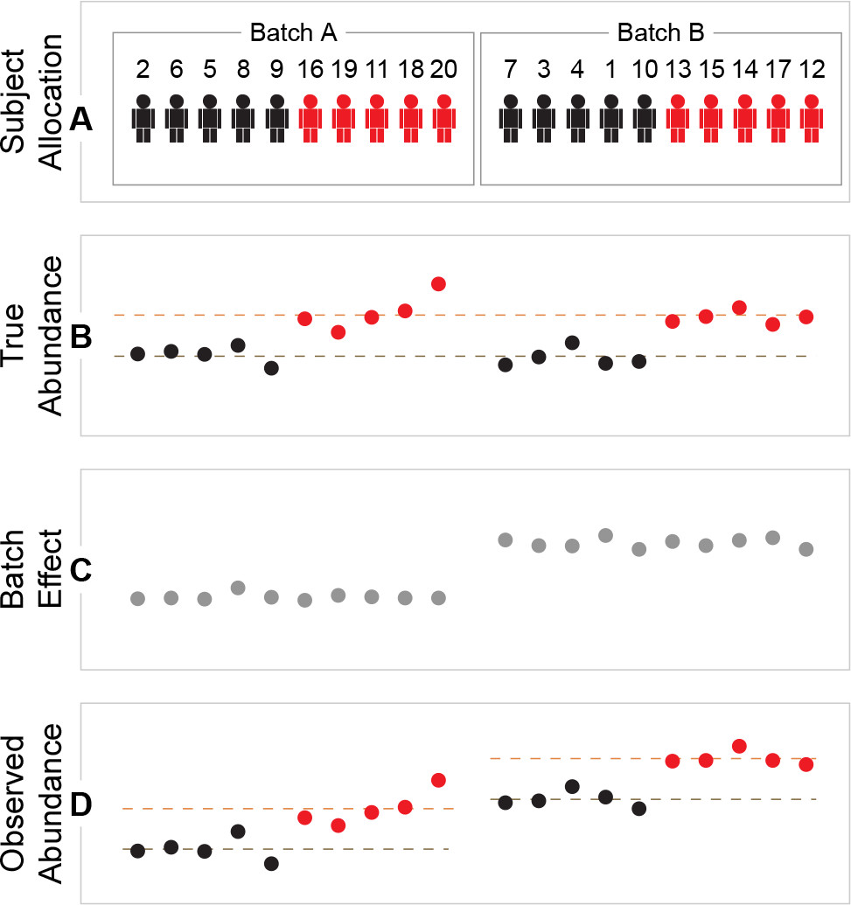

# Randomization

Randomization is a core element of experimental design. In LC–MS metabolomics/lipidomics it helps ensure that **systematic technical effects** (e.g., instrument drift, column aging, carryover, temperature changes, operator effects) do not become **confounded with biology** (e.g., case/control, treatment groups, time points).

In practice, randomization is usually applied at multiple stages:

- **Sample preparation order** (extraction/derivatization/dilution)
- **Injection/run order** (sequence on the instrument)
- **Batch allocation** (if samples must be measured across days, columns, instruments, or methods)

Samples should be randomized during both preparation and acquisition. When necessary, allocate to batches in a way that balances groups across batches. The goal is to ensure that technical variation is **distributed across groups** rather than systematically aligned with them. 

---

## Why randomize in LC–MS?

Even with stable instrumentation, LC–MS data typically show time-dependent and batch-dependent variation. If one biological group is injected earlier and another later, differences can reflect **run-order effects** rather than true biology.

Randomization aims to:

- **Distribute** unknown nuisance variation across groups
- **Reduce bias** in estimates of group differences
- Improve robustness of downstream steps such as **normalization** and **differential analysis**

{ width=400px }

---

## Types of randomization

### Complete randomization

In **complete randomization**, every sample has the same probability of being assigned to any position (e.g., injection index 1…N).

Use when:

- You have a **single batch** (or batches are negligible)
- You have **no strong constraints** (e.g., few special samples, minimal carryover concerns)
- Group sizes are reasonably balanced

Limitations:

- By chance, a group can still cluster early/late in the run, especially for small studies.
- It does not guarantee balance across time windows.

{ width=400px }

### Block randomization

**Block randomization** means constructing the injection sequence as a series of **small blocks**, where **each block contains a balanced composition of samples** with respect to:

- the primary biological groups (e.g., case/control, dose levels), and
- selected covariates (i.e., *strata* such as sex, site, acquisition day, plate), when applicable.

You then randomize the order **within each block** and often also randomize block order. This design distributes samples evenly across the run, reducing the risk that **run-order drift** becomes confounded with biology.

Use when:

- You expect **drift over time** (common in long sequences)
- You want each part of the run to contain a similar composition of groups
- You have multiple plates or preparation days and want balance within each

Typical ways to define blocks:

- **Fixed-size injection windows** (e.g., blocks of 8, 12, or 16 injections), constructed to be balanced by group/strata
- **Plate- or day-based blocks** (when acquisition is naturally segmented), again constructed to be balanced by group/strata

{ width=400px }

{ width=400px }

> **Note for repeated measures / paired samples:** 

> If multiple samples originate from the **same subject** (e.g., longitudinal time points, matched tissues, or technical replicates), keep them in the **same block** (and ideally the same analytical batch) whenever possible. This reduces within-subject differences driven by drift across distant parts of the run and preserves the interpretability of paired/within-subject comparisons.

---

## Batch allocation

When the sequence is too long for a single batch, or when samples arrive in multiple waves, you may need to run multiple batches. In this case, **batch design** is critical to ensure that batch effects do not become confounded with biology.

A “batch” can mean different things in practice:

- **Preparation batch**: same extraction day/operator/reagent lot/plate
- **Analytical batch**: same day/column/instrument/method settings

The key rule is that do not let **batch membership** become a proxy for **biological group**.

Recommendations:

- Allocate samples so each batch contains a **balanced representation** of study groups.
- Spread **independent biological replicates** across batches when feasible (to avoid confounding biological effects with batch and to make batch effects estimable).
- If you must run a group in a separate batch (e.g., samples arrive later), document it and plan for explicit batch modeling.

{ width=400px }

---

References:

1. Burger, Bram, Marc Vaudel, and Harald Barsnes. "Importance of block randomization when designing proteomics experiments." Journal of proteome research 20.1 (2020): 122-128.

