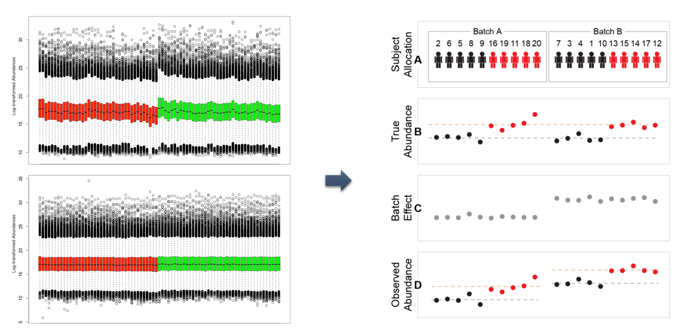
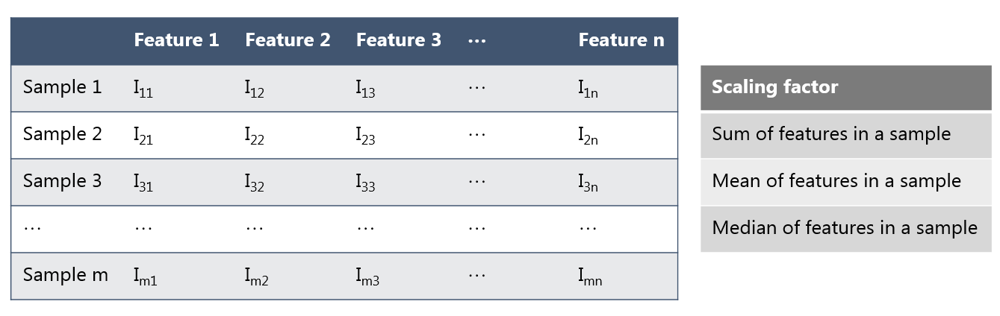
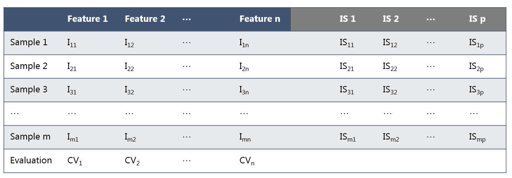
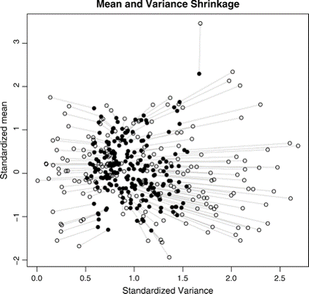
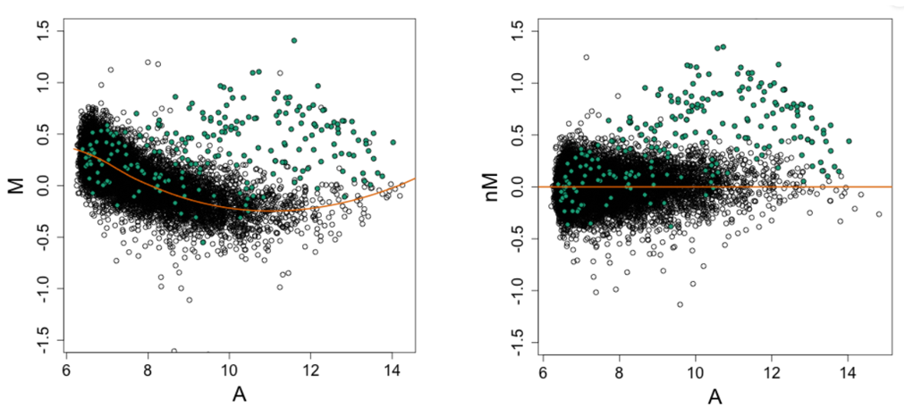
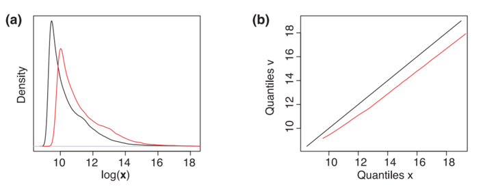
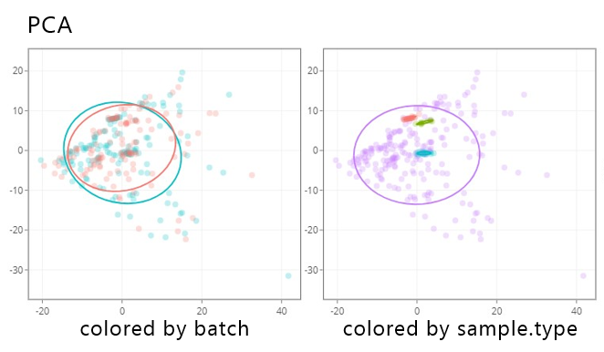
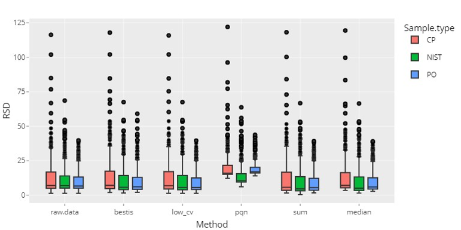

# Normalization
Signal drift and batch effect
{ width="800" }
## Method
### General method

Sum / Mean / Median

Calculation: Imn / scaling factor 
After normalization, all samples have the same sum / mean / median

### Internal standard based method

Best internal standard / Lowest CV
NOMIS

Calculation: Imn / ISmp 
Internal standards are chosen based on CVn in pool samples

### Linear method

Limma / Combat
Based on linear model
Consider the batch effect as a covariate and adjust for it

### Non-linear method

Lowess
Based on MA plot (LogFC vs mean) 
Model paired data as a function of mean intensity

### Signal-dependent non-linear method

Qspline
Based on distribution
Model paired data at different quantiles as a function of mean intensity

## Evaluation

PCA plot, different QC samples
Pooled RSD / median absolute deviation (MAD) / variance in QC samples

