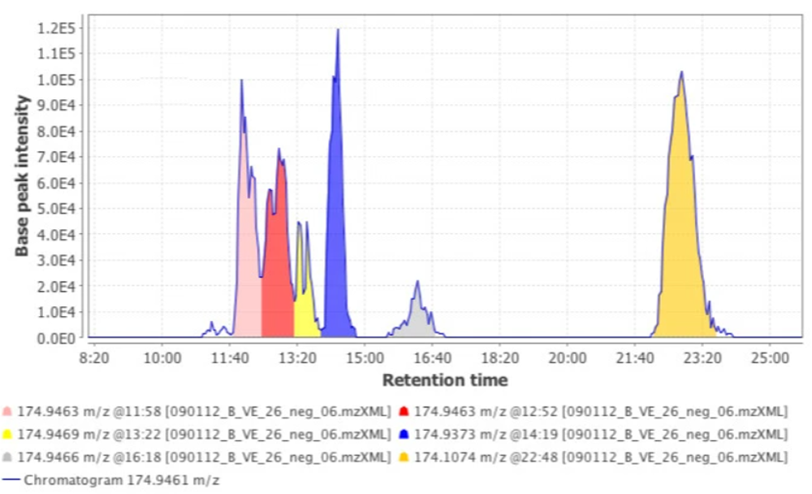
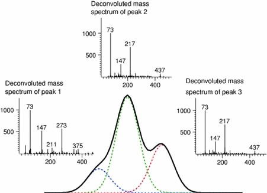
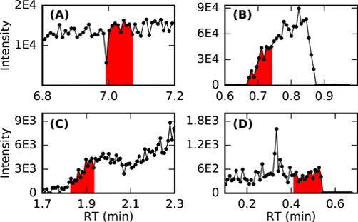
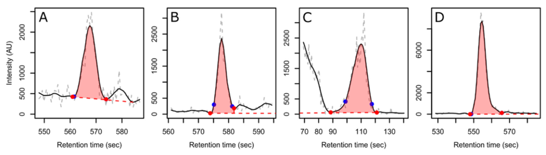
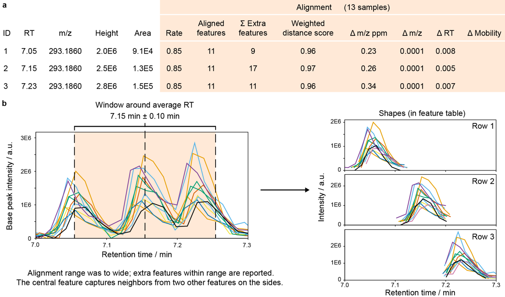
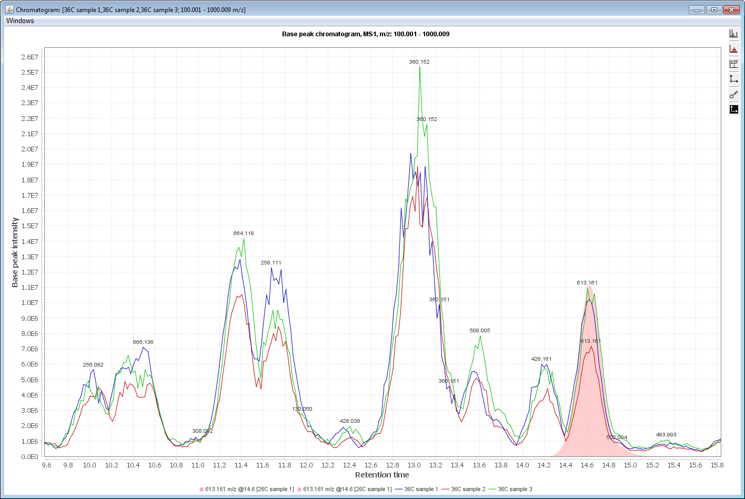
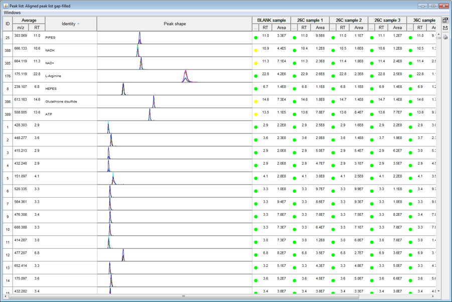
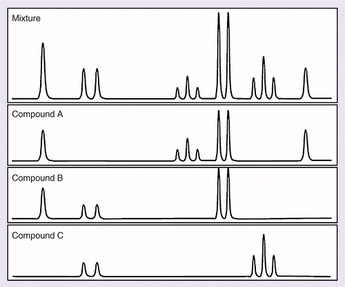
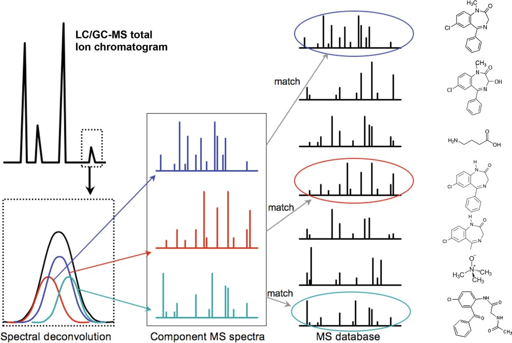
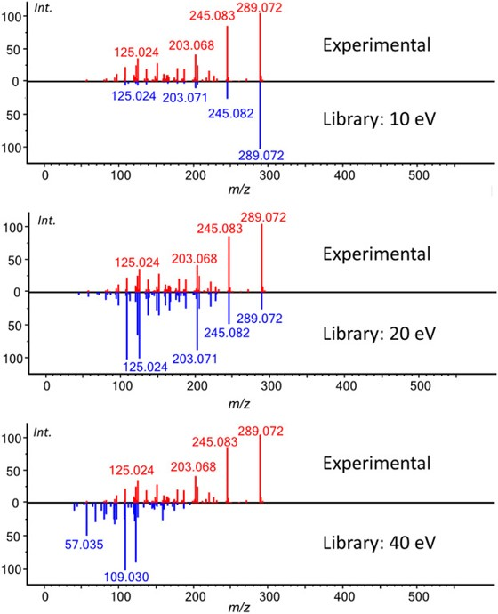

# Preprocessing

In general, the data preprocessing procedure is shown below:

## Construction of EICs

## Peak detection

### Issues:
- **Co-eluting metabolites**

Example of deconvolution: three overlapping peaks were separated, making use of the mass spectral information. This results in a peak table with the response for all three individual metabolites and their corresponding mass spectrum

- **False positive peaks**

- **Difficulty in estimating boundries**

## Alignment

## Gap filling

## Identification
### MS1 level
Based on m/z and RT:

### MS2 level
Based on MS2 spectrum matching

#### Match with different collision energy

