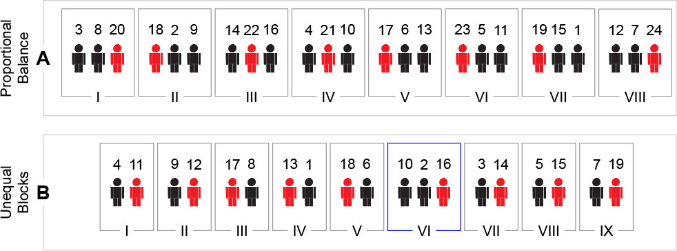

# Randomization

Randomization is used in experimental design to
minimize the influence of unanticipated confounders.

{ width=400px }

## Types of randomization

### Complete randomization
{ width=400px }

### Block randomization 
{ width=400px }

{ width=400px }

## Batch allocation
{ width=400px }

