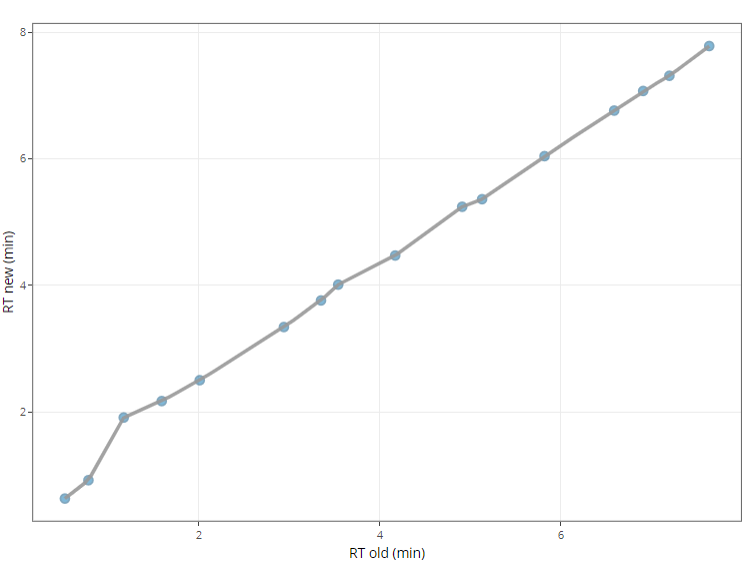

# Retention time prediction

The retention time acquired in the chromatographic system might shift due to the change of mobile phase, instrument conditions, columns, etc. Therefore, we need to update the library, i.e. predict the new retention time.

{ width=400px }

