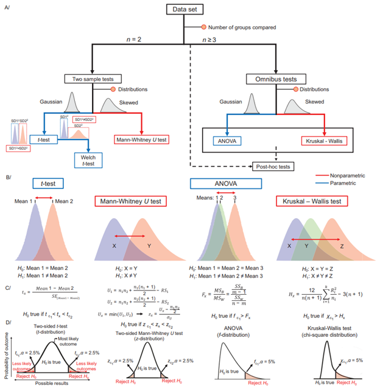

# Univariate Analysis

Univariate analysis examines each variable (feature, metabolite, or lipid) independently to identify significant differences between groups or associations with outcomes. This approach is foundational in metabolomics and lipidomics for hypothesis testing and biomarker discovery.

## What is Univariate Analysis?

- Focuses on one variable at a time, ignoring correlations with other variables.
- Commonly used to:
   - Compare groups (e.g., disease vs. control)
   - Assess associations with continuous outcomes (e.g., age, BMI)
   - Screen for potential biomarkers

## Group Comparison Tests

- **t-tests:**
   - Compare the means of two groups (e.g., control vs. treatment).
   - Assumes data are normally distributed and have equal variances (use Welch’s t-test if variances differ).
- **ANOVA (Analysis of Variance):**
   - Compare means across three or more groups.
   - Assumes normality and equal variances; significant results indicate at least one group differs.
- **Mann–Whitney U test:**
   - Non-parametric alternative to the t-test for two groups.
   - Does not assume normality; compares medians or ranks.
- **Kruskal–Wallis test:**
   - Non-parametric alternative to ANOVA for three or more groups.
   - Tests for differences in distributions across groups.

### Post-hoc Testing

- After a significant ANOVA or Kruskal–Wallis result, use post-hoc tests (e.g., Tukey’s HSD, Dunn’s test) to determine which specific groups differ.
- Post-hoc tests control for multiple comparisons and help interpret complex group differences.

### Multiple Testing Correction

- When testing many features, the chance of false positives increases.
- Apply corrections such as:
   - **Bonferroni correction:** Very stringent; divides the significance threshold by the number of tests.
   - **Benjamini–Hochberg FDR:** Controls the expected proportion of false discoveries; less stringent and widely used in omics.
- Always report both raw and adjusted p-values.

---

## Correlation Analysis

- **Correlation analysis:**
   - Measures the strength and direction of association between a continuous outcome (e.g., age, clinical measurement) and each  feature.
   - **Pearson correlation:** Assumes linear relationship and normality.
   - **Spearman correlation:** Non-parametric; assesses monotonic relationships using ranks.
- **Partial correlation analysis:**
  - Measures the association between two variables while controlling for the effect of one or more additional variables (e.g., adjusting for age or sex).

