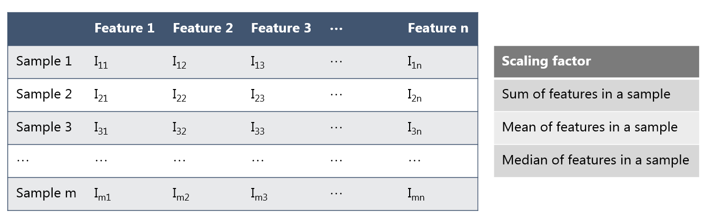
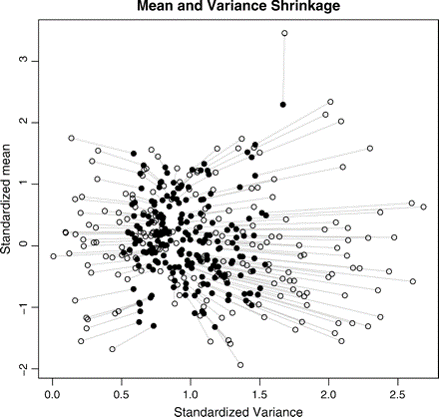
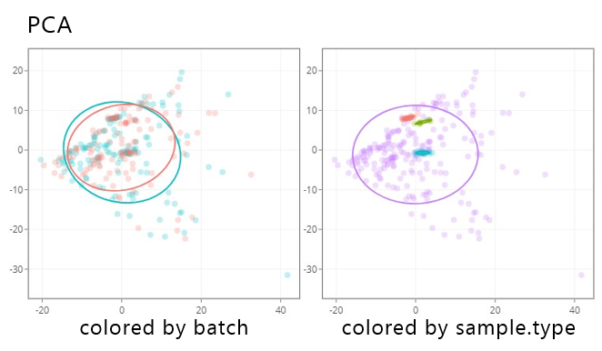

# Normalization

Normalization aims to remove **unwanted technical variation** (e.g., signal drift, injection-to-injection variability, and batch effects) while preserving true biological differences.

In typical workflows, normalization is applied **before** downstream steps such as data transformation and scaling.

Signal drift and batch effect

{ width="800" }

---

## Methods

### General (global scaling)

Global scaling methods (sum/mean/median) apply a single sample-wise scaling factor so that all samples have the same total intensity (or the same mean/median intensity).

- Typical use: when most features are expected not to change strongly across samples.
- Risk: if a large fraction of features truly changes (e.g., strong global shifts), global scaling can remove biological signal.

**Common choices**

- **sum**: forces the sum of intensities per sample to be equal.
- **mean**: forces the mean intensity per sample to be equal.
- **median**: forces the median intensity per sample to be equal (often more robust than mean).
- **mTIC**: modified total ion current scaling; a TIC-style sample-wise scaling intended to be more robust than raw TIC when a subset of features is unstable.

**Calculation (conceptual)**

For feature intensity $I_{m,n}$ (feature $m$, sample $n$):

- Compute a sample-wise scaling factor $s_n$ (e.g., sample sum / global reference sum).
- Normalize: $I'_{m,n} = I_{m,n} / s_n$.

### Internal-standard based

Internal-standard (IS) normalization scales each feature using one or more spiked compounds expected to track technical variation.

- Typical use: targeted/quantitative workflows or untargeted workflows with good IS coverage.
- Requirement: IS should be stable and behave similarly to analytes (ideally class- and RT-matched).

**Practical strategy**

- Select the “best” IS (or IS set) based on **low CV** in pooled QC samples.
- Methods such as **NOMIS** use multiple IS to improve robustness.

**Common choices**

- **bestis**: normalization each feature using the "best" internal standard (the one that shows the highest correlation with the feature across QC samples).
- **lowCV**: normalization using the internal standard with the lowest CV in pooled QCs.
- **nomis**: normalization using multiple internal standards (multi-IS strategy).

**Calculation (conceptual)**

For a chosen internal standard signal $IS_{p,n}$ in sample $n$:

- $I'_{m,n} = I_{m,n} / IS_{p,n}$

### Sample-wise dilution / size-effect normalization

These methods aim to correct sample-to-sample dilution or total-amount differences that affect many features.

- **PQN (probabilistic quotient normalization)**: estimates a sample-specific dilution factor from the distribution of feature-wise quotients relative to a reference (often a pooled QC or a median sample) and scales the sample accordingly.

> Note: PQN assumes that most metabolites do not change strongly and that the dominant difference is a global dilution/size effect.

### Distribution-based (between-sample) normalization

These methods reshape sample distributions to make them more comparable. Use with care if global shifts are expected.

- **quantile**: forces samples to have the same empirical distribution (common in transcriptomics; can be useful for strongly distribution-driven batch effects but may remove real global biology).
- **contrast**: a contrast-based rescaling approach used in some -omics toolchains to reduce distributional differences (implementation varies; document the software and parameters).
- **liwong**: Li–Wong style normalization (originating from microarray processing); if used, document the exact implementation because details differ across tools.

### Linear batch-effect adjustment

Linear methods explicitly model batch effects and remove them.

- Examples: **limma**, **ComBat**.
- Idea: treat batch as a covariate in a linear model and adjust the data accordingly.
- Requirement: batch structure must be known and reasonably represented in the data.

Additional model-based methods sometimes offered by tools:

- **linear**: a generic label for linear-model adjustment.

### Non-linear drift correction

Non-linear methods model intensity-dependent drift, often using QC injections across the run.

- Example: **LOESS/LOWESS**.
- Idea: model paired differences (often on an MA plot: log fold-change vs mean intensity) as a smooth function of intensity/time.

Additional non-linear options you may encounter:

- **cubic**: cubic smoothing/interpolation-based correction.
- **batch_loess**: LOESS-based correction applied within batches (typically leveraging QC injections and run order).
- **batch_ratio**: ratio-based within-batch correction relative to QC/reference samples.

### Signal-dependent non-linear

Signal-dependent non-linear methods correct drift using distribution/quantile behavior.

- Example: **Q-spline**.
- Idea: model paired data at multiple quantiles as a function of mean intensity to handle intensity-dependent effects.

### Machine-learning based drift correction

These approaches learn drift patterns from QC injections and correct sample intensities accordingly.

- **SERRF**: QC-based machine-learning drift correction (random-forest style approaches are commonly used) designed to reduce run-order/batch drift.
- **svm**: support vector machine-based correction (implementation varies; typically uses QC/run-order information to model drift).

> Note: ML-based correction can be powerful but should be validated carefully (e.g., improvement in pooled-QC RSD without collapsing biological group separation).

---

## Evaluation

Use both visual and quantitative checks, focusing on QC samples.

Recommended evaluation is **before vs after** normalization, using the same feature table and QC definitions.

### Visual checks

- **PCA (colored by sample type and batch)**: pooled QC injections should cluster tightly after normalization; separation by **batch** should be reduced.
- **PCA (colored by run order/time)**: check whether run-order trends are reduced.
- **Run-order drift plots (QC only)**: for a set of representative features (or summary statistics), plot intensity vs injection order.
- **Boxplots/density plots**:
	- Across samples: distributions should become more comparable.
	- Watch-out: forcing distributions to match too strongly (e.g., aggressive distribution normalization) can remove real global biology.

### Quantitative QC metrics

Compute metrics primarily on pooled QC injections (or on technical replicates).

- **RSD% in pooled QC** per feature:
	- the distribution of QC RSD shifts lower after normalization.
- **MAD / robust variance** in pooled QC:
	- Prefer robust metrics when outliers exist.
- **QC correlation**:
	- Pairwise correlation between pooled QC injections should increase after normalization.

### Overcorrection checks

- **Known biology / positive controls**: if you expect specific changes, ensure they are not eliminated.
- **Internal standards**: their behavior should become more consistent, but IS correction should not create implausible shifts in unrelated features.
- **Biological group structure**:
	- Normalization should reduce technical separation (batch/run-order) without collapsing real biological differences.
	- If groups become indistinguishable *only after* normalization, re-check assumptions and method choice.

