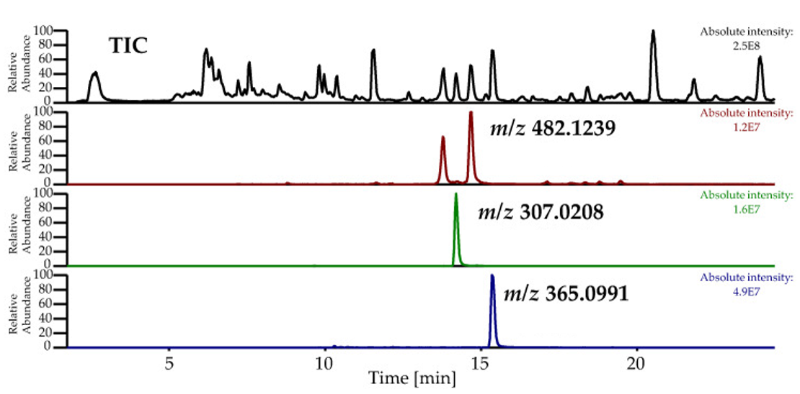
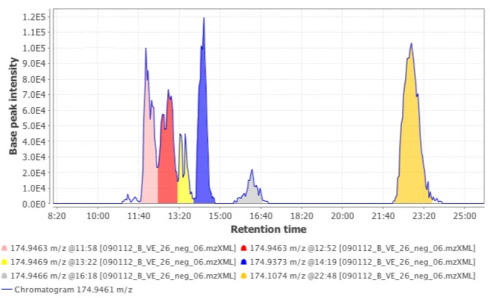
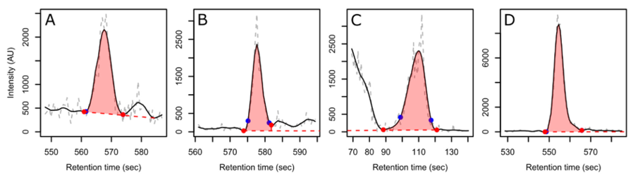
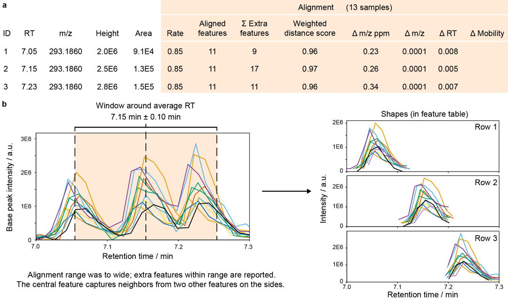
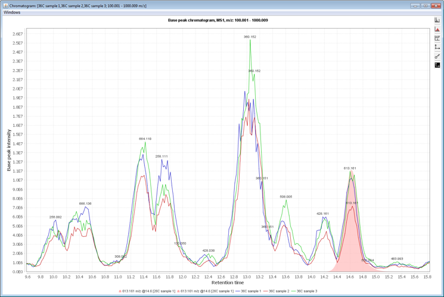

# Preprocessing

Untargeted preprocessing transforms raw LC–MS(/MS) data into a **feature table**. In practice, it consists of detecting chromatographic peaks, aligning them across samples, filling missing values created by detection limits, and annotating features using MS1/MS2 information.

In general, the preprocessing procedure is shown below (figure from [mzmine documentation](https://mzmine.github.io/)). Different software tools implement similar steps with varying algorithms and parameters, but the overall workflow is relatively consistent across platforms.

## Procedures

Below is a practical description of the workflow shown above. Exact module names and parameters vary by software you use. If your dataset does **not** include ion mobility (IMS), steps related to mobility can be skipped.

---

**1. Data import**

   Load vendor/open-format raw files and verify MS1/MS2 levels, polarity, and metadata (sample names, injection order, batch).

---

**2. Mass detection**

   Convert raw spectra into centroid “mass lists” by applying a noise threshold. This strongly affects sensitivity and false positives.

---

**3. Mobility scan merging (IMS only)**

   Combine mobility-resolved scans as needed to improve signal quality and define the unit of downstream feature detection. The common approach is to merge scans within a narrow RT window (e.g., 0.1–0.2 min) to create a single “chromatogram” for each m/z value, which is then used for peak detection and alignment.

---

**4. EIC building**

   Build extracted ion chromatograms (EICs) by grouping signals across retention time within an m/z tolerance.
   - Practical considerations:
     - Choose an m/z tolerance appropriate for your instrument mode (often 10 ppm for high-resolution data).
     - Ensure consistent settings across samples (especially when multiple batches/instruments are involved).

   

---

**5. Smoothing**

   Reduce high-frequency noise in chromatograms to stabilize peak shape and improve peak boundary detection.

---

**6. Resolving (chromatographic peak deconvolution)**

   - Detect chromatographic peaks (features) in EICs and deconvolute overlapping peaks based on shape and spectral consistency.
   - Key parameters (tool-specific names vary):
     - Noise threshold / minimum intensity
     - Minimum peak width and expected chromatographic peak shape
     - Mass/RT tolerances used during deconvolution

   

   **Common issues**

   - **Co-eluting metabolites**

     

     Example of deconvolution: three overlapping peaks are separated using mass spectral information, yielding a peak table with responses for each individual metabolite and their corresponding spectra.

   - **False positive peaks**

     

     Common causes include random noise, unstable baselines, and integration of non-peak structures. Tighten noise thresholds and/or peak shape constraints if false positives dominate.

   - **Difficulty estimating boundaries**

     

     Incorrect boundaries bias peak areas and increase variability. Check a subset of representative peaks (high, medium, low abundance; different RT regions) to confirm settings.

---

**7. IMS expanding (IMS only)**

   Expand chromatographic features into the mobility dimension (or reconstruct mobility-resolved features).

---

**8. Smoothing (IMS only)**

   Apply smoothing in the mobility dimension to reduce noise and stabilize mobility peak shapes.

---

**9. Resolving (IMS only)**

   Detect/resolve mobility peaks to separate co-migrating signals in the IMS dimension.

---

**10. 13C isotope filtering**

   Remove or flag likely isotope signals (e.g., M+1/M+2 patterns) to reduce redundant features.

---
    
**11. Isotope finder**

   Group isotopologues belonging to the same feature and annotate isotope relationships.

---

**12. Join aligner**

   Align features across samples using retention time and m/z tolerances so the same compound is represented consistently.

   - Practical considerations:

      - Inspect before/after alignment plots to confirm drift correction is plausible.
      - Use pooled QCs to validate that alignment reduces RT scatter without over-warping.

   
   

---

**13. Gap filling**

   Recover intensities for aligned features that were missed during detection by integrating signal in the expected RT/m/z window.

   - Practical considerations:

      - Prefer gap filling methods that integrate only within a constrained RT/m/z window.
      - Track how gap filling changes missingness and distributions; do not use it to mask systematic problems (e.g., misalignment).

   

---

**14. Duplicate filter**

   Remove redundant features produced by overlapping detection/grouping (e.g., duplicate entries with nearly identical RT and m/z).

---

**15. Feature grouping**

   Group features from the same compound (e.g., adducts, isotopes, in-source fragments) based on co-elution. This reduces redundancy and supports annotation.

---

**16. Ion identity networking (adduct/complex linking)**

   Link features that likely represent the same molecule as different adducts/in-source fragments; supports cleaner annotation and reduces redundancy.

---

**17/18. Spectral library search (MS/MS)**

   Assign chemical meaning to features using MS/MS information. This step will be explained in more detail in the [identification section](untar_identification.md). Here we focus on the general concept.

   

   - MS2 annotations use fragment spectra to increase confidence via library matching.

   

   - If your acquisition uses multiple collision energies, compare matches across energies (fragment patterns can shift with energy).

   

---

**19. Local database search (MS1)**
    
   If you have a custom spectral library (e.g., from standards or previous experiments), search against it to assign known identities to features based on accurate mass and retention time (and ccs).

---

**20. Lipid annotation (lipidomics only)**

   Use rule based annotation to assign lipid classes and sum compositions/lipid species based on MS1/MS2 patterns. This step will be covered in more detail in the [identification section](untar_identification_lip.md), but the general idea is to use characteristic fragments and neutral losses to classify lipids and assign acyl chain compositions where possible.

---

**21. Feature filtering**

   This will be covered in more detail in the [post processing section](untar_clean.md).