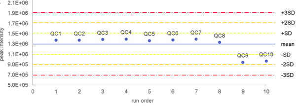
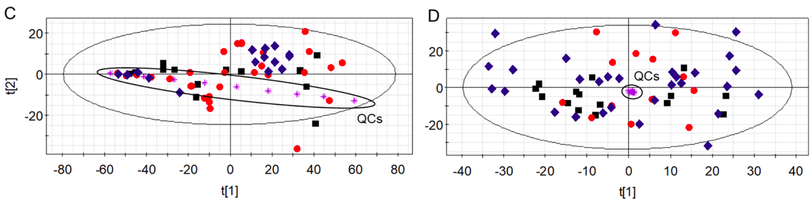

# Quality control (QC)

QC in metabolomics/lipidomics aims to detect and control **technical variation** (sample preparation, instrument drift, batch effects, carryover, contamination) so that biological interpretation is reliable.

This page summarizes common QC approaches. Use thresholds appropriate for your platform and study design, and always document the rules you apply.

--- 

## Common QC sample types

This has been covered in the [QC samples setup](design_qc_setup.md) section.

---

## QC procedures

### Inspection of blank samples
Use procedural blanks to identify molecular features driven by **background contamination** and **carryover**, rather than the biological matrix.

- **Common sources of blank signal:**
  - Solvent/reagent impurities
  - Sample-prep artifacts (e.g., derivatization “ghost peaks”)
  - Labware and LC–MS system contamination (e.g., plasticizers, column bleed)
  - Carryover due to insufficient washing (features appearing in blanks after high-abundance injections)

- **Flag potential contaminants (screening rule):**
  - Flag features as “potential contaminants” when their mean intensity in real samples does not exceed **2–3×** the mean intensity in blanks (i.e., low sample/blank ratio).
  - If filtering is needed, consider discarding only flagged features with **high variability in blanks** (e.g., **blank RSD > 15%**). Stable blank signals are less likely to differentially bias group comparisons, but should still be interpreted with caution for features of interest.

### Inspection of internal standards
Use internal standards to detect **run-order drift** and **out-of-control events** that indicate unstable instrument performance (e.g., sensitivity loss, chromatographic deterioration, sudden failures such as clogs).

- **Run-order drift (gradual changes):**
  - Plot IS **intensity**, **RT**, and **m/z** vs **injection order** to identify time-related trends.

- **Out-of-control measurements (sudden changes):**
  - Create **Shewhart control charts** for key IS metrics with warning/action limits (±1 SD, ±2 SD, ±3 SD).
  - Flag problematic segments, for example:
    - **1** QC/IS point outside **±3 SD**
    - **2** consecutive points outside **±2 SD** on the same side of the mean
    - **4** consecutive points outside **±1 SD** on the same side of the mean
    - **10** consecutive points on the same side of the mean
  - If QC/IS metrics fail these rules, **scrutinize neighboring study injections** and decide whether they should be **excluded and reanalyzed**, since abrupt failures are often not fully correctable by normalization.

### Inspection of pooled QCs
- Plot signal intensities with respect to the run order to check for time-related drifts.
- Examine PCA scores plot to check the distribution of samples.
  - Use **PCA scores** (colored by run order and sample type) to assess whether samples show a continuous drift across the run. Pooled QCs should ideally cluster tightly (often near the center), indicating stable performance.

### Pooled QC dilution series checks (linearity and dynamic range)

If you run pooled-QC dilutions:

- Check that features show monotonic response with dilution.
- Use this to identify features dominated by noise/saturation and to support more defensible filtering.

### Inspection of outliers
Outliers can arise from sample preparation issues, instrument problems, or true biological extremes. Here we focus on technical outliers that may need to be excluded or reanalyzed.
- Samples located outside the 95% Hotelling T² ellipse in the PCA scores plot.
- IS intensity outside a robust range (e.g., median ± 3×MAD)
- Unusually high/low total IS signal (sum/median across IS)
- RT shift beyond tolerance for multiple IS

### Pre-analytical markers
- Create box plots and check for abnormal levels (±3×IQR).

Pre-analytical handling (collection, processing, aliquoting, transport, storage, and freeze–thaw cycles) is a major source of variability—especially in multicenter and biobank studies—and can cause contamination, degradation, and ex vivo metabolic changes that are not addressed by analytical QC alone. Common issues include insufficient quenching (continued enzymatic activity such as lipid hydrolysis), oxidation/light- or air-induced transformations of labile metabolites, delayed blood processing or poor temperature control (shifts in energy metabolites), hemolysis (release of intracellular metabolites), and urine degradation due to bacterial overgrowth.

To monitor sample integrity, track a panel of pre-analytical marker metabolites known to respond to these errors and visualize them using box plots to flag abnormal values (e.g., intensities outside ±3× IQR). Because these markers can also vary biologically, interpret them as a pattern (multiple markers) before excluding samples, and adapt the marker panel to the biological matrix (blood/urine or tissue-specific markers).

### Overall data quality assessment
- Verify the clustering of QCs in PCA scores plots.
- Check method precision and accuracy:
  - RSD < 30% for peak intensity
  - RSD < 2% for retention time
  - RSD < 15% for peak width
  - m/z error < 10 ppm
- Create time series plots with predefined tolerance windows to visualize reproducibility and stability across the experiment for every quality metric.
- Flag features with technical variation exceeding the biological inter-individual variability.

