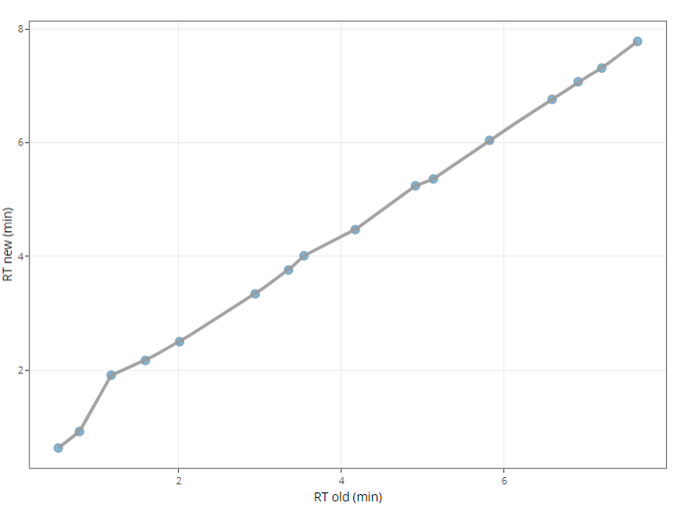

# Retention time prediction

The retention time acquired in the chromatographic system might shift due to the change of mobile phase, instrument conditions, columns, etc. Therefore, we need to update the library, i.e. predict the new retention time. This can be achieved by using a set of standard compounds with known retention times to build a prediction model, which is then used to predict the retention times of other compounds in the library.

{ width=400px }

